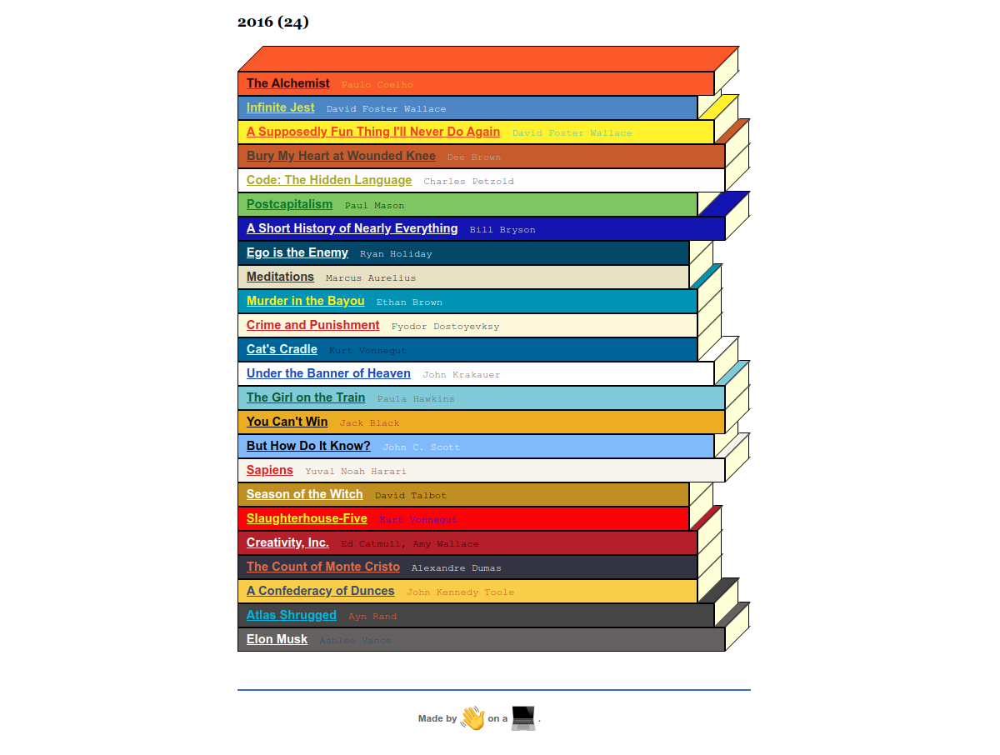

Generate a static site for your own reading list:

#+BEGIN_SRC racket
(main '((2019 ("Title Here" "Author Here" "Cover Url Here")
              ("Title Here" "Author Here" "Cover Url Here")
                ...)
        (2018 (...)
               ...)
        ...)
#+END_SRC

Example found at http://loosetyp.es

Aesthetic inspired, at least in part, by the neat stacks from The Paris Review:

