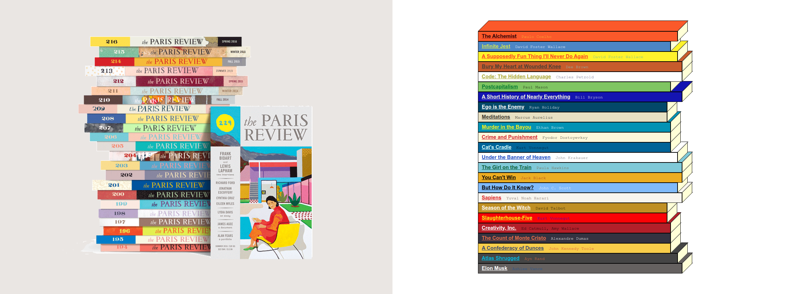

Generate a static site for your own reading list:

```racket
(main '((2019 ("Title Here" "Author Here" "Cover Url Here")
              ("Title Here" "Author Here" "Cover Url Here")
                ...)
        (2018 (...)
               ...)
        ...)
```

Inspired, at least in part, by the book stacks from The Paris Review (left):




